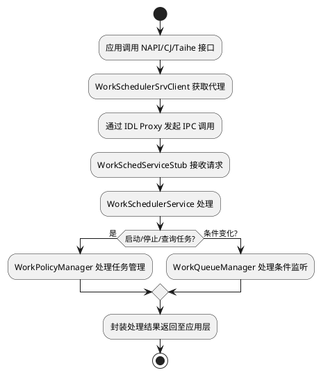
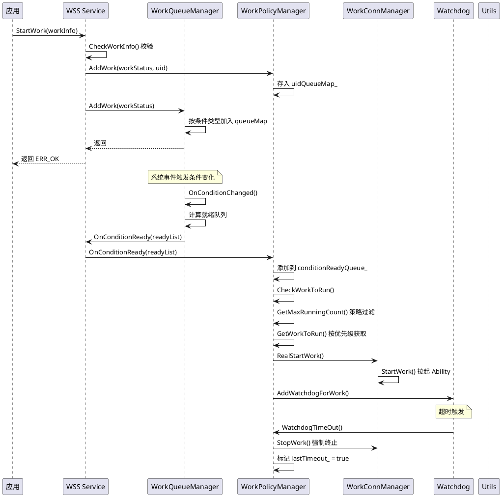
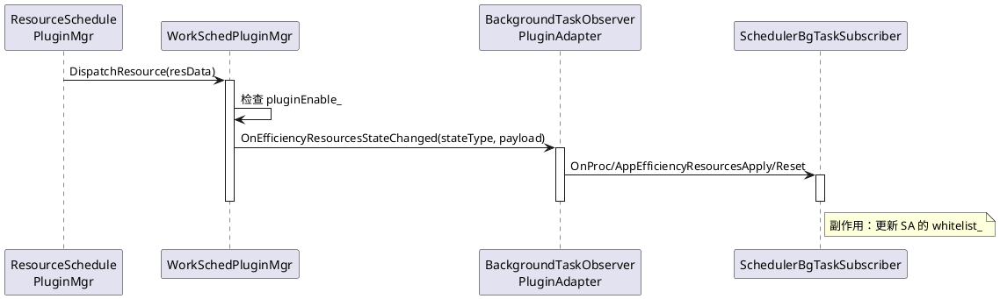
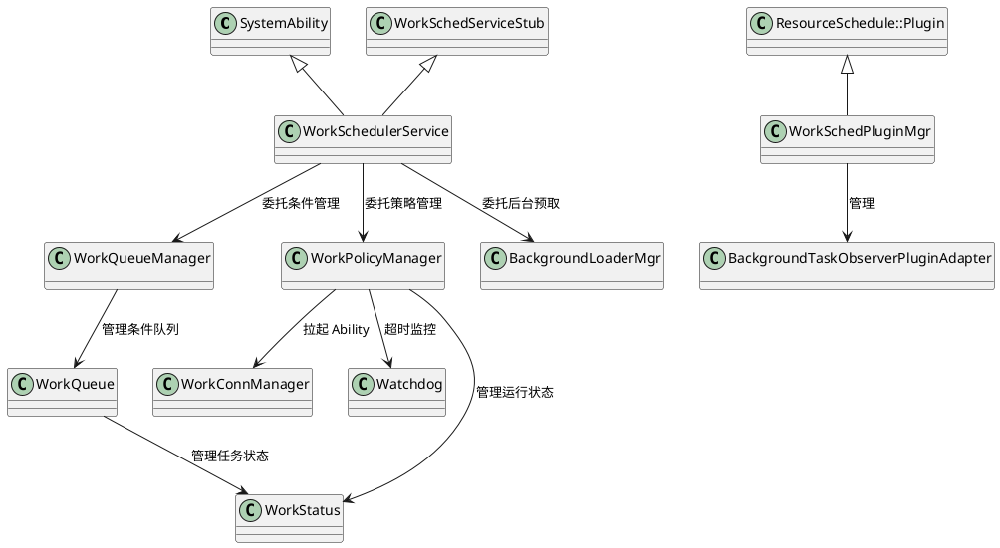

# 公共框架代码设计

> 文档版本：v1.0
> 更新时间：2026-09-10

## 上下文与场景

### IPC 调用链

从应用调用到服务端处理的完整 IPC 调用链路：

```
应用 ArkTS/JS/CJ/Taihe 代码
    → NAPI/CJ FFI/Taihe 模块 (kits/) 将多语言调用转为 C++ 调用
    → WorkSchedulerSrvClient (frameworks/) 获取服务代理
    → IWorkSchedService 代理 (IDL 自动生成的 Proxy 类)
    → IPC 跨进程调用
    → WorkSchedServiceStub (IDL 自动生成的 Stub 类)
    → WorkSchedulerService (services/native/) 分发处理
    → WorkQueueManager (条件队列管理) / WorkPolicyManager (策略与运行管理)
```

IDL 接口文件 `frameworks/IWorkSchedService.idl` 定义了全部对外 IPC 方法。框架层通过 `WorkSchedulerSrvClient` 单例获取服务代理，内部维护 `IWorkSchedService` 代理指针和死亡监听。



## 部署拓扑

部署拓扑图详见 [docs/knowledge/architecture.md](../knowledge/architecture.md) 的"部署拓扑"章节。

## 知识关联

### 核心组件交互关系

延迟任务调度组件由 `WorkSchedulerService` 统一入口，内部委托 `WorkQueueManager`（条件队列管理）和 `WorkPolicyManager`（策略与运行管理）两大子管理器，共享 `utils/native/` 中的公共基础设施。

**共享基础设施**：`WorkSchedUtils`、`WorkSchedulerConfig`、`DataManager`、`WorkSchedHiSysEventReport` 等，详见 [docs/knowledge/architecture.md](../knowledge/architecture.md) 的"公共基础设施索引"。

**条件队列与策略运行的交互**：
- `WorkQueueManager` 计算条件就绪任务列表，通过 `OnConditionChanged` 回调通知 `WorkSchedulerService`
- `WorkSchedulerService` 将就绪任务转发给 `WorkPolicyManager::OnConditionReady`
- `WorkPolicyManager` 经策略过滤后调用 `RealStartWork`，通过 `WorkConnManager` 拉起 Ability

**数据流交叉点**：
- 应用卸载/数据清理时，`AppDataClearListener` 通知 `WorkPolicyManager` 清理对应任务
- 能效资源申请/释放时，`SchedulerBgTaskSubscriber` 通知 `WorkSchedulerService` 更新白名单
- 设备待机状态变化时，`WorkStandbyStateChangeCallback` 通知 `WorkSchedulerService` 调整运行上限
- 应用分组变化时，`WorkBundleGroupChangeCallback` 通知 `GroupListener` 调整执行频率约束



## 代码与符号

### 公共基础设施索引

公共基础设施（`WorkSchedUtils`、`WorkSchedulerConfig`、`DataManager` 等）详见 [docs/knowledge/architecture.md](../knowledge/architecture.md) 的"公共基础设施索引"。

### 插件能力

`services/plugin/` 模块提供延迟任务调度服务的插件化事件接收能力。插件管理器 `WorkSchedPluginMgr` 继承自 `ResourceSchedule::Plugin`，通过资源调度子系统 `PluginMgr` 的 C API（`Init` / `Disable` / `DispatchResource`）接收系统资源事件，分发给已注册的插件适配器处理。

**插件类一览**：

| 类名 | 头文件 | 职责 |
|---|---|---|
| `WorkSchedPluginMgr` | `services/plugin/include/work_sched_plugin_mgr.h` | 插件管理器，继承 `ResourceSchedule::Plugin` 单例，管理插件生命周期和事件分发 |
| `BackgroundTaskObserverPluginAdapter` | `services/plugin/include/background_task_observer_plugin_adapter.h` | 后台任务观察者插件适配器，处理能效资源状态变化和云配置更新事件，桥接到 `SchedulerBgTaskSubscriber` |

**事件分发流程**：



### 类继承关系


