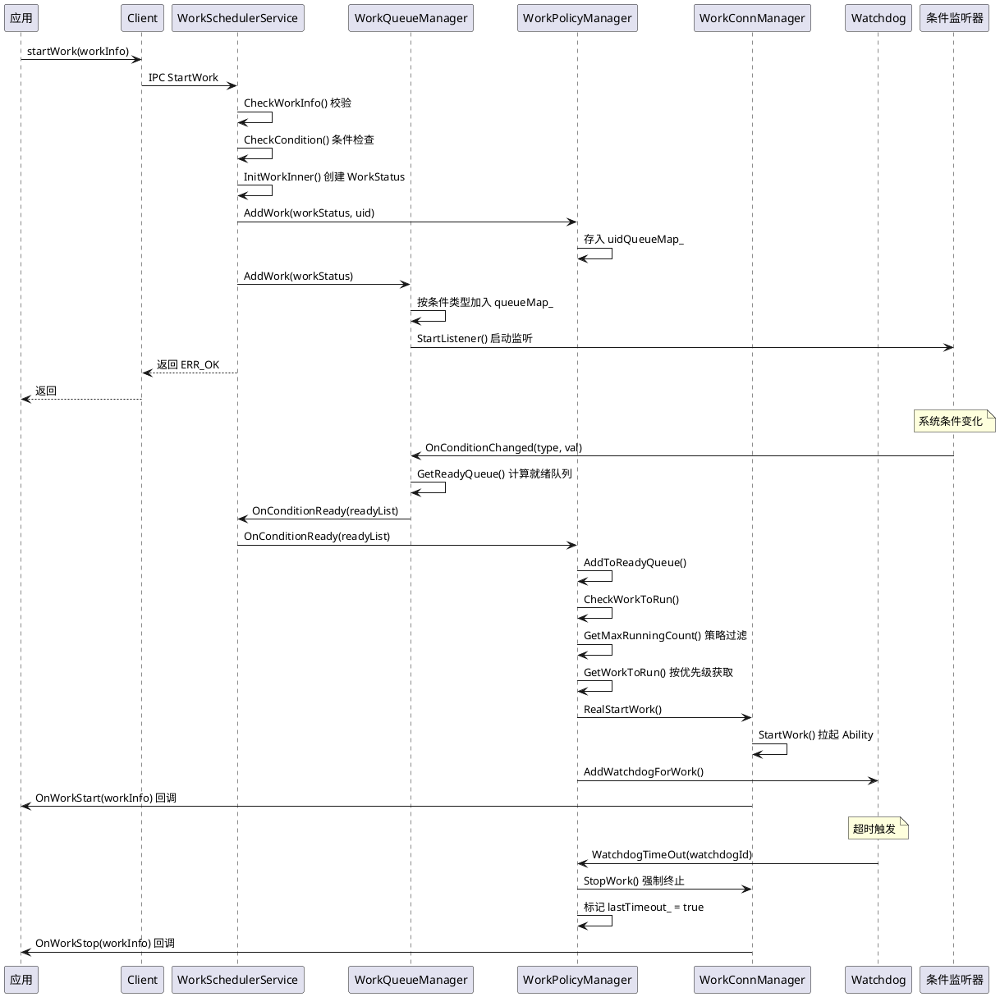
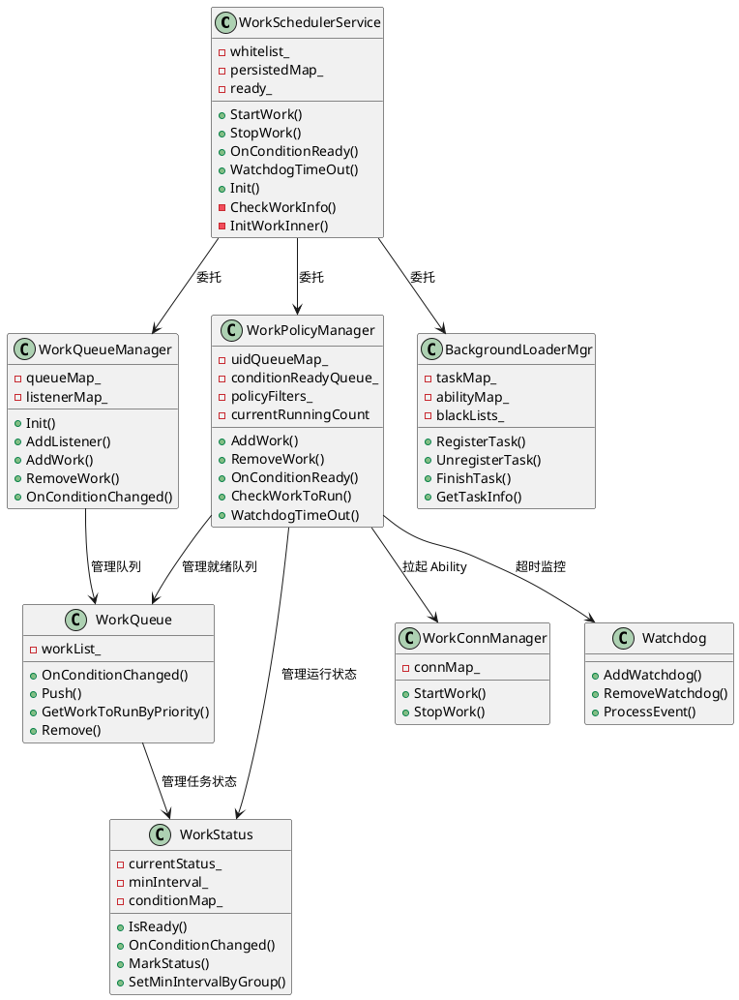

# 延迟任务代码设计

> 文档版本：v1.0
> 更新时间：2026-09-10

## 上下文与场景

### 触发时机

- 应用调用 `startWork` 申请延迟任务
- 系统条件满足时（网络连接、充电、定时器到期等）排队触发任务执行
- 应用可通过 `stopWork` 主动停止任务
- 系统在超时、应用卸载、用户切换等场景自动清理任务

### 参与角色

| 角色 | 职责 |
|---|---|
| 应用 | 调用 `startWork` 申请延迟任务，任务完成后调用 `stopWork` 取消 |
| WorkSchedulerService | 服务入口，校验调用合法性、管理持久化任务和预安装任务、分发请求 |
| WorkQueueManager | 条件队列管理，维护条件类型到队列和监听器的映射，计算条件就绪任务 |
| WorkPolicyManager | 策略与运行管理，策略过滤、就绪队列管理、运行队列管理、进程拉起、超时监控 |
| WorkConnManager | 连接管理，拉起 `WorkSchedulerExtensionAbility` 并管理连接 |
| Watchdog | 超时监控器，定时器到期后强制终止任务 |
| 条件监听器 | 监听系统状态变化（网络/电池/充电/屏幕/存储/定时器/分组/待机），回调 `OnConditionChanged` |
| 策略过滤器 | 根据系统状态（电源/内存/热/CPU）限制运行任务数 |
| BackgroundLoaderMgr | 后台预取管理器，管理后台预取任务的生命周期、超时和黑名单 |

### 运行时序

## 知识关联

### 依赖的公共模块类

公共基础设施（`WorkSchedUtils`、`WorkSchedulerConfig`、`DataManager`、`WorkSchedHiSysEventReport` 等）详见 [docs/knowledge/architecture.md](../knowledge/architecture.md) 的"公共基础设施索引"。

### 交互的外部系统服务

| 外部服务 | 交互方式 |
|---|---|
| Ability管理服务（AbilityManager） | `WorkConnManager` 通过 `AbilityManager` 拉起 `WorkSchedulerExtensionAbility` |
| Bundle 管理服务（BundleMgr） | 查询包信息、验证 Ability 声明、判断系统应用 |
| 公共事件服务（CommonEvent） | 监听应用安装/卸载/更新、用户切换等事件 |
| 电池管理服务（BatteryManager） | `BatteryLevelListener` / `BatteryStatusListener` 读取电池信息 |
| 热管理服务（ThermalManager） | `ThermalPolicy` 读取设备温度 |
| 电源管理服务（PowerManager） | `PowerModePolicy` 读取电源模式 |
| 网络管理服务（NetManager） | `NetworkListener` 查询网络连接状态 |
| 定时器服务（TimeService） | `TimerListener` 周期性定时触发 |
| 设备使用信息统计（DeviceUsageStats） | `GroupListener` 监听应用使用频率分组变化 |
| 设备待机（DeviceStandby） | `WorkStandbyStateChangeCallback` 监听待机状态 |
| 后台任务管理（BgTaskMgr） | `SchedulerBgTaskSubscriber` 订阅能效资源事件 |
| 资源调度服务（ResourceSchedule） | `WorkSchedPluginMgr` 接收插件分发事件 |
| 数据共享（DataShare） | `WorkDataShareHelper` 访问 DataShare URI |

### 条件监听器与策略过滤器关联

`WorkQueueManager` 管理 8 种条件监听器，`WorkPolicyManager` 管理 4 种策略过滤器。条件监听器检测到条件变化后通过 `OnConditionChanged` 回调触发就绪队列计算；策略过滤器通过 `GetPolicyMaxRunning` 在 `CheckWorkToRun` 时限制运行任务上限。

## 数据模型

### WorkInfo

延迟任务信息封装，定义于 `frameworks/include/work_info.h`，继承 `Parcelable`：

| 字段 | 类型 | 默认值 | 说明 |
|---|---|---|---|
| `workId_` | `int32_t` | `INVALID_VALUE` | 延迟任务 ID，应用内唯一标识，必填 |
| `bundleName_` | `std::string` | 空 | 包名，必填 |
| `abilityName_` | `std::string` | 空 | Ability 名，必填 |
| `uid_` | `int32_t` | `INVALID_VALUE` | 应用 UID，系统填充 |
| `persisted_` | `bool` | `false` | 是否持久化 |
| `conditionMap_` | `std::map<WorkCondition::Type, std::shared_ptr<Condition>>` | 空 | 条件映射 |
| `extras_` | `std::shared_ptr<AAFwk::WantParams>` | `nullptr` | 额外参数 |
| `callBySystemApp_` | `bool` | `false` | 是否由系统应用调用 |
| `preinstalled_` | `bool` | `false` | 是否预安装任务 |
| `uriKey_` | `std::string` | 空 | URI 键 |
| `appIndex_` | `int32_t` | `0` | 应用索引（多用户场景） |
| `saId_` | `int32_t` | `INVALID_VALUE` | 系统能力 ID |
| `residentSa_` | `bool` | `false` | 是否常驻 SA |
| `isInnerApply_` | `bool` | `false` | 是否内部申请 |
| `earliestStartTime_` | `int32_t` | `0` | 最早开始时间（毫秒） |
| `createTime_` | `uint64_t` | 当前时间 | 创建时间（毫秒） |
| `deepIdleTime_` | `int32_t` | `0` | 深度空闲时间（毫秒） |
| `triggerType_` | `int32_t` | `UNKNOWN` | 触发类型 |

### WorkStatus

延迟任务运行状态，定义于 `services/native/include/work_status.h`：

| 字段 | 类型 | 说明 |
|---|---|---|
| `workId_` | `std::string` | 任务唯一标识（u_uid_workId） |
| `bundleName_` | `std::string` | 包名 |
| `abilityName_` | `std::string` | Ability 名 |
| `uid_` | `int32_t` | 应用 UID |
| `userId_` | `int32_t` | 用户 ID |
| `workStartTime_` | `uint64_t` | 任务开始时间 |
| `workWatchDogTime_` | `uint64_t` | 看门狗时间 |
| `duration_` | `uint64_t` | 执行时长 |
| `paused_` | `bool` | 是否暂停 |
| `persisted_` | `bool` | 是否持久化 |
| `priority_` | `int32_t` | 执行优先级 |
| `needRetrigger_` | `bool` | 是否需要重新触发 |
| `timeRetrigger_` | `int32_t` | 重新触发时间 |
| `conditionMap_` | `std::map<WorkCondition::Type, std::shared_ptr<Condition>>` | 条件映射 |
| `workInfo_` | `std::shared_ptr<WorkInfo>` | 原始 WorkInfo |
| `delayReason_` | `std::string` | 延迟原因 |
| `lastTimeout_` | `bool` | 上次是否超时 |
| `currentStatus_` | `Status` | 当前状态 |
| `baseTime_` | `time_t` | 基准时间 |
| `minInterval_` | `int64_t` | 最小执行间隔 |
| `timeout_` | `std::atomic<bool>` | 是否超时 |
| `debugTask_` | `std::atomic<bool>` | 是否调试任务 |
| `groupChanged_` | `bool` | 分组是否变化 |
| `conditionStatus_` | `std::string` | 条件状态字符串 |

### BackgroundLoaderTaskInfo

后台预取任务信息，定义于 `frameworks/include/background_loader_task_info.h`，继承 `Parcelable`：

| 字段 | 类型 | 默认值 | 说明 |
|---|---|---|---|
| `taskId_` | `int32_t` | `0` | 任务 ID |
| `abilityName_` | `std::string` | `""` | Ability 名 |

### FrequencyInfo

执行频率信息，定义于 `frameworks/include/frequency_info.h`，继承 `Parcelable`：

| 字段 | 类型 | 默认值 | 说明 |
|---|---|---|---|
| `uid_` | `int32_t` | `-1` | 目标应用 UID |
| `workId_` | `int32_t` | `-1` | 任务 ID |
| `interval_` | `int64_t` | `-1` | 执行间隔（毫秒） |

## 代码与符号

### 核心类

| 类名 | 职责 |
|---|---|
| `WorkSchedulerService` | 主服务类，继承 `SystemAbility` + `WorkSchedServiceStub`，延迟任务调度入口 |
| `WorkQueueManager` | 条件队列管理器，维护条件类型到队列和监听器的映射 |
| `WorkPolicyManager` | 策略与运行管理器，协调策略过滤器，管理就绪队列和运行队列 |
| `WorkQueue` | 任务队列类，按优先级排序管理任务列表 |
| `WorkStatus` | 延迟任务状态类，封装运行状态和条件匹配逻辑 |
| `WorkConnManager` | 连接管理器，拉起 Ability 扩展并管理连接 |
| `WorkSchedulerConnection` | Ability 连接回调 |
| `Watchdog` | 超时监控器，继承 `EventHandler`，定时器到期强制终止任务 |
| `WorkEventHandler` | 事件处理器，继承 `EventHandler`，处理重触发、服务初始化等事件 |
| `BackgroundLoaderMgr` | 后台预取管理器，管理后台预取任务生命周期 |
| `WorkSchedulerConfig` | 配置管理器（`DelayedSingleton`） |
| `DataManager` | 数据管理器（`DelayedSingleton`） |
| `WorkSchedPluginMgr` | 插件管理器，继承 `ResourceSchedule::Plugin` |
| `BackgroundTaskObserverPluginAdapter` | 后台任务观察者插件适配器 |
| `SchedulerBgTaskSubscriber` | 能效资源订阅者 |

### 条件监听器

| 监听器 | 监听内容 | 触发条件 |
|---|---|---|
| `NetworkListener` | 网络连接状态 | WiFi/蜂窝/以太网连接/断开 |
| `BatteryLevelListener` | 电池电量 | 电量变化超过阈值 |
| `BatteryStatusListener` | 电池状态 | 低电量/电量正常 |
| `ChargerListener` | 充电状态 | 充电/放电/充电类型变化 |
| `ScreenListener` | 屏幕状态 | 屏幕亮/灭，影响深度空闲判定 |
| `StorageListener` | 存储状态 | 存储空间低/正常 |
| `TimerListener` | 定时器 | 定时周期到期（默认 10 分钟） |
| `GroupListener` | 应用分组 | 应用分组变化 |

**IConditionListener 接口**：
- `OnConditionChanged(Type, DetectorValue)`：条件变化回调
- `Start()`：启动监听
- `Stop()`：停止监听

### 策略过滤器

| 策略器 | 控制逻辑 |
|---|---|
| `PowerModePolicy` | 省电模式限制运行数 |
| `MemoryPolicy` | 内存压力限制运行数 |
| `ThermalPolicy` | 过热状态限制运行数 |
| `CpuPolicy` | CPU 占用过高限制运行数 |

**IPolicyFilter 接口**：
- `GetPolicyMaxRunning(WorkSchedSystemPolicy&)`：获取策略允许的最大运行数

### 策略监听器

| 监听器 | 控制逻辑 |
|---|---|
| `AppDataClearListener` | 监听应用更新/退出/用户切换，清理任务 |

**IPolicyListener 接口**：
- `OnPolicyChanged(PolicyType, DetectorValue)`：策略变化回调
- `Start()`：启动监听
- `Stop()`：停止监听

### 事件类型

事件枚举（定义于 `work_event_handler.h`）：

| 枚举值 | 说明 |
|---|---|
| `RETRIGGER_MSG` | 重新触发消息 |
| `SERVICE_INIT_MSG` | 服务初始化消息 |
| `IDE_RETRIGGER_MSG` | IDE 调试重新触发消息 |
| `CHECK_CONDITION_MSG` | 检查条件消息 |

### 关键方法

IDL 接口方法详见 [docs/spec/work_scheduler.md](../spec/work_scheduler.md) 的"innerAPI 功能"。
以下为内部回调方法：

| 方法 | 说明 |
|---|---|
| `OnConditionReady` | 条件就绪回调 |
| `WatchdogTimeOut` | 超时回调 |
| `UpdateEffiResApplyInfo` | 更新能效资源白名单 |

### 内部数据结构

`WorkPolicyManager` 维护的映射表：

| 成员 | 说明 |
|---|---|
| `uidQueueMap_` | UID → 任务队列映射 |
| `conditionReadyQueue_` | 条件就绪队列 |
| `policyFilters_` | 策略过滤器列表 |
| `workConnManager_` | 连接管理器 |
| `watchdog_` | 超时监控器 |
| `watchdogIdMap_` | Watchdog ID → 任务映射 |
| `currentRunningCount` | 当前运行任务数 |
| `watchdogTime_` | 看门狗超时时间（默认 `WATCHDOG_TIME`） |

`WorkQueueManager` 维护的映射表：

| 成员 | 说明 |
|---|---|
| `queueMap_` | 条件类型 → 任务队列映射 |
| `listenerMap_` | 条件类型 → 监听器映射 |
| `timeCycle_` | 定时器周期（默认 `TIME_CYCLE` = 10 分钟） |

`WorkSchedulerService` 维护的状态：

| 成员 | 说明 |
|---|---|
| `whitelist_` | 能效资源白名单 UID 集合 |
| `persistedMap_` | 持久化任务映射 |
| `exemptionBundles_` | 免控包名集合 |
| `preinstalledBundles_` | 预安装包名集合 |
| `ready_` | 服务就绪状态 |
| `handler_` | 事件处理器 |
| `frequencyMap_` | 执行频率映射（callingUid → uid → FrequencyInfo） |

### 类继承调用关系

## 关键数据标记

延迟任务的实现依赖一组关键数据标记与字段来管理任务状态、条件匹配、优先级和执行频率约束。

### 标记位与字段定义

| 标记/字段 | 所在位置 | 类型 | 含义 |
|---|---|---|---|
| `workId_` | `WorkInfo` / `WorkStatus` | `int32_t` / `string` | 任务唯一标识，`WorkStatus` 中格式为 `u_{uid}_{workId}` |
| `persisted_` | `WorkInfo` / `WorkStatus` | `bool` | 是否持久化，`true` 时任务信息落盘 JSON 文件，设备重启后恢复 |
| `conditionMap_` | `WorkInfo` / `WorkStatus` | `map` | 条件映射，键为 `WorkCondition::Type`，值为 `Condition` 结构体 |
| `currentStatus_` | `WorkStatus` | `Status` | 任务当前状态（WAIT_CONDITION/CONDITION_READY/RUNNING/REMOVED） |
| `minInterval_` | `WorkStatus` | `int64_t` | 最小执行间隔，根据应用分组动态设置 |
| `lastTimeout_` | `WorkStatus` | `bool` | 上次执行是否超时，供 `IsLastWorkTimeout` 查询 |
| `priority_` | `WorkStatus` | `int32_t` | 执行优先级，影响 `GetWorkToRunByPriority` 排序 |
| `paused_` | `WorkStatus` | `bool` | 是否暂停，`PauseRunningWorks` 设置 |
| `needRetrigger_` | `WorkStatus` | `bool` | 是否需要重新触发 |
| `timeout_` | `WorkStatus` | `atomic<bool>` | 是否超时 |
| `callBySystemApp_` | `WorkInfo` | `bool` | 是否由系统应用调用，影响执行优先级和权限策略 |
| `preinstalled_` | `WorkInfo` | `bool` | 是否预安装任务 |
| `isInnerApply_` | `WorkInfo` | `bool` | 是否内部申请，跳过常规校验流程 |
| `saId_` | `WorkInfo` | `int32_t` | 系统能力 ID，标识 SA 关联的闲时任务，SA注册任务的必要条件是息屏 |
| `residentSa_` | `WorkInfo` | `bool` | 是否常驻 SA，影响进程拉起策略 |
| `earliestStartTime_` | `WorkInfo` | `int32_t` | 最早开始时间，延迟触发场景 |
| `deepIdleTime_` | `WorkInfo` | `int32_t` | 深度空闲时间 |
| `triggerType_` | `WorkInfo` | `int32_t` | 触发类型 |
| `uriKey_` | `WorkInfo` | `string` | URI 键，关联 DataShare URI |
| `appIndex_` | `WorkInfo` | `int32_t` | 应用索引，多用户场景 |
| `whitelist_` | `WorkSchedulerService` | `set<int32_t>` | 能效资源白名单 UID，申请了 `WORK_SCHEDULER` 资源的应用加入白名单 |
| `ready_` | `WorkSchedulerService` | `atomic<bool>` | 服务就绪状态门控 |
| `watchdogTime_` | `WorkPolicyManager` | `atomic<int32_t>` | 看门狗超时时间，默认 `WATCHDOG_TIME`(2 分钟)，可配置为 `MEDIUM_WATCHDOG_TIME`(10 分钟)或 `LONG_WATCHDOG_TIME`(20 分钟) |
| `currentRunningCount` | `WorkPolicyManager` | `int32_t` | 当前运行任务数，受 `MAX_RUNNING_COUNT` 约束 |
| `frequencyMap_` | `WorkSchedulerService` | `map` | 执行频率映射（callingUid → uid → FrequencyInfo），覆盖默认分组间隔 |

### 执行频率约束机制

`WorkStatus::minInterval_` 的设置逻辑：

1. 应用分组变化时通过 `SetMinIntervalByGroup(group)` 设置：
   - 活跃分组：2 小时
   - 日常使用分组：4 小时
   - 固定分组：24 小时
   - 罕见使用分组：48 小时
   - 受限/未使用分组：禁止执行
2. 充电状态下可缩短间隔（`SetMinIntervalWhenCharging`）
3. 通过 `SetExecFrequency` 可自定义间隔，覆盖默认分组约束（`frequencyMap_`）
4. `s_uid_last_time_map` 静态映射记录每个 UID 的上次执行时间，用于间隔判定

### 持久化与恢复机制

- `persistedMap_`：内存中维护持久化任务映射，key 为 workId 字符串
- 落盘：`RefreshPersistedWorks()` 将 `persistedMap_` 序列化为 JSON 文件
- 恢复：服务启动时 `InitPersistedWork()` 从 JSON 文件读取，`ReadPersistedWorks()` 解析
- 预安装任务：`InitPreinstalledWork()` 从配置文件加载，`ReadPreinstalledWorks()` 解析
- 云配置更新：`SetWorkSchedulerConfig` 接收云配置，更新最小重复时间、豁免应用列表、预安装任务等

## DFX 实现设计

DFX 设计规格详见 [docs/spec/work_scheduler.md](../spec/work_scheduler.md) 的"DFX 设计"。
