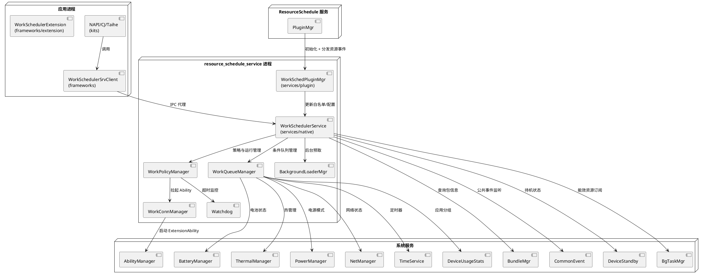

# 架构原则

> 文档版本：v1.0
> 更新时间：2026-09-10
> 本文档阐述延迟任务调度组件的架构原则，包括三层架构、SA 概念、目录结构、编译方式、构建特性开关、部署拓扑与公共基础设施索引。

## 三层架构

延迟任务调度组件采用三层架构，自上而下为接口层、框架层、服务层：

| 层 | 目录 | 职责 |
|---|---|---|
| 接口层（interfaces） | `interfaces/kits/` | 提供多语言外部 API（JS/NAPI、CJ 仓颉、ETS/Taihe） |
| 框架层（frameworks） | `frameworks/` | 客户端代理 `WorkSchedulerSrvClient`，封装 IPC 调用；IDL 接口定义； |
| 服务层（services） | `services/` | 服务端实现，包含核心服务入口 `WorkSchedulerService`、条件监听、策略管理、任务执行与持久化 |

## SA 概念

`WorkSchedulerService` 是延迟任务调度的系统服务入口，继承自 `SystemAbility` 基类，SA ID：1904（`WORK_SCHEDULE_SERVICE_ID`）。

源码位置：`services/native/include/work_scheduler_service.h`

## 目录结构总览

```
work_scheduler/
├── docs/                    # 知识库
│   ├── knowledge/           # 基本概念与业务背景
│   ├── spec/                # 规格描述
│   └── design/              # 代码实现
├── frameworks/              # 框架层（客户端代理 + IDL + 扩展能力）
│   ├── extension/           # WorkSchedulerExtension 扩展能力
│   └── test/                # 框架层单元测试
├── interfaces/              # 接口层
│   ├── kits/                # 多语言 API 绑定（JS/NAPI、CJ、ETS/Taihe）
│   └── test/                # 接口层单元测试
├── services/                # 服务层
│   ├── native/              # 核心服务实现（含 conditions/ 条件监听、policy/ 策略过滤）
│   ├── zidl/                # IPC stub/proxy + 回调 IDL
│   ├── plugin/              # 插件框架
│   └── test/                # 服务层单元测试
├── utils/                   # 公共工具类
│   └── native/              # 日志、错误码、常量、工具函数
├── sa_profile/             # 系统能力配置
├── test/                    # FUZZ 测试
│   ├── fuzztest/            # 模糊测试
│   └── resource/            # 测试资源
├── workscheduler.gni        # 路径与特性开关定义
├── bundle.json              # 组件元数据
└── BUILD.gn                 # 根构建文件
```

## 编译方式

组件信息详见 [docs/knowledge/business_context.md](business_context.md) 的"组件信息"。

### 源码交付件构建

源码交付件分为框架层和服务层两个构建组：

| 构建 target | 说明 | 包含内容 |
|---|---|---|
| `fwk_group_work_scheduler_all` | 框架层构建组 | 客户端库 `workschedclient`、扩展能力 `workschedextension`、CJ FFI、Taihe 绑定、NAPI 绑定、扩展能力 NAPI |
| `service_group_work_scheduler_all` | 服务层构建组 | 服务实现 `workschedservice` |

```bash
# 构建全量组件（框架 + 服务）
--build-target work_scheduler

# 仅构建框架层
--build-target fwk_group_work_scheduler_all

# 仅构建服务层
--build-target service_group_work_scheduler_all
```

### 测试代码交付件构建

测试交付件通过 `test_work_scheduler_all` 构建组统一管理：

| 测试类型 | 目录 | 说明 |
|---|---|---|
| 框架层 UT | `frameworks/test/unittest/` | `workinfotest`（WorkInfo 序列化测试） |
| 接口层 UT | `interfaces/test/unittest/work_scheduler_jsunittest/` | `js_unittest`（JS 接口测试） |
| 服务层 UT | `services/test/` | `unittest`（服务端单元测试） |
| FUZZ 用例 | `test/fuzztest/` | IPC 安全模糊测试 |

```bash
# 构建全部测试
--build-target test_work_scheduler_all

# 运行单元测试（需在设备上执行）
hdc file send {test_binary} /data/local/tmp/
hdc shell
/data/local/tmp/{test_binary}
```

## 构建特性开关

构建特性定义于 `workscheduler.gni`，通过 `declare_args` 声明，在 `services/BUILD.gn` 中通过 `defines` 宏控制代码编译：

| 特性 | 默认值 | 说明 |
|---|---|---|
| `work_scheduler_device_enable` | true | 设备使能开关（false 时跳过全部构建） |
| `bundle_active_enable` | true | 设备使用统计（应用分组）支持 |
| `device_standby_enable` | true | 设备待机支持 |
| `resourceschedule_bgtaskmgr_enable` | true | 后台任务管理支持 |
| `powermgr_battery_manager_enable` | true | 电池管理支持 |
| `powermgr_thermal_manager_enable` | true | 热管理支持 |
| `powermgr_power_manager_enable` | true | 电源管理支持（含省电模式策略） |
| `workscheduler_with_communication_netmanager_base_enable` | true | 网络管理支持 |
| `workscheduler_hicollie_enable` | true | HiCollie 卡死检测支持 |

## 部署拓扑



## 公共基础设施索引

`utils/native/` 模块提供延迟任务调度服务的公共基础设施：

| 类名/文件 | 头文件 | 职责 |
|---|---|---|
| `WorkSchedUtils` | `utils/native/include/work_sched_utils.h` | 静态工具类，提供账户 ID 获取、UID 转用户 ID、路径转换、系统应用判断、时间获取、扩展信息校验 |
| `WorkSchedSystemPolicy` | `utils/native/include/work_sched_system_policy.h` | 系统策略状态结构体，包含 CPU 占用、可用内存、热级别、电源模式 |
| `WorkSchedulerConfig` | `services/native/include/work_sched_config.h` | 配置管理器（`DelayedSingleton`），管理活跃分组白名单和云配置更新 |
| `DataManager` | `services/native/include/work_sched_data_manager.h` | 数据管理器（`DelayedSingleton`），管理设备休眠/深度空闲状态、设备待机白名单/限制名单、应用分组映射 |
| `WorkSchedHiSysEventReport` | `utils/native/include/work_sched_hisysevent_report.h` | HiSysEvent 上报工具，提供状态变更、策略限制、异常上报 |
| 日志宏 | `utils/native/include/work_sched_hilog.h` | `WS_HILOG*` 五级日志宏 |
| 错误码 | `utils/native/include/work_sched_errors.h` | 服务错误码和参数错误码定义 |
| 常量 | `utils/native/include/work_sched_constants.h` | 运行限制、超时时间、事件码等常量定义 |
